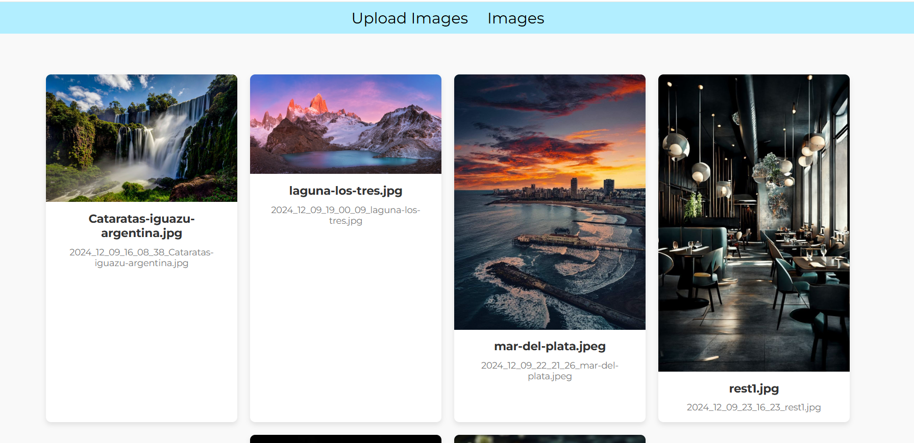

# Práctica Subir Imágenes 
Implementar una aplicación web en Laravel que permita la subida, almacenamiento, visualización y organización de imágenes. Utiliza un almacenamiento seguro mediante el guardado en storage/private y en una base de datos.

## Interfaz subida de imágenes

## Interfaz Galeria
